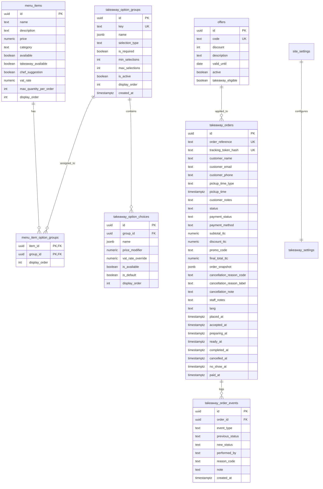
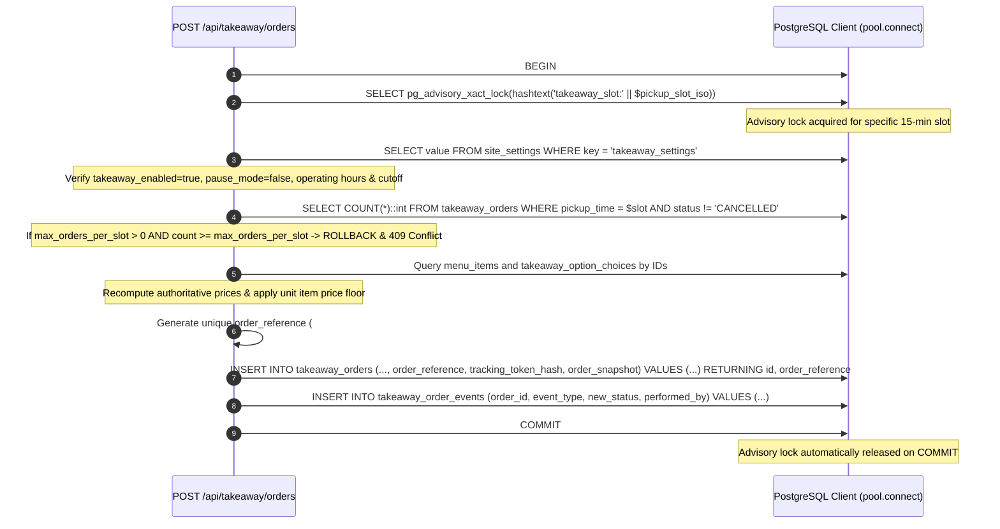
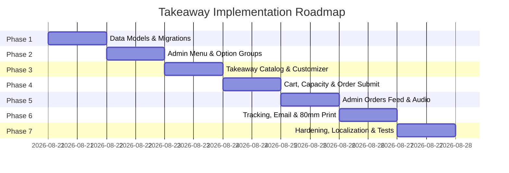

# Takeaway Feature — Implementation Architecture & Engineering Plan

**Document Status:** Approved Technical Blueprint (Hardened & Finalized)  
**Target Repository:** `lechoppe-official`  
**Governing Documents:** [AGENTS.md](file:///Users/mahabubul.hasan/Desktop/project/TriloyTech/lechoppe-official/AGENTS.md) · [docs/takeaway/REQUIREMENTS.md](file:///Users/mahabubul.hasan/Desktop/project/TriloyTech/lechoppe-official/docs/takeaway/REQUIREMENTS.md)

---

## 1. Technical Overview

This plan defines the comprehensive engineering architecture for implementing the **Takeaway Ordering System** in `lechoppe-official`. The implementation provides a commission-free, direct online takeaway channel for *L'Échoppe de Paris*, featuring item customization with option groups, real-time cart management, PostgreSQL advisory-locked slot scheduling, guest checkout, onsite counter settlement, asynchronous multilingual confirmation receipts, secure unguessable order tracking, an admin kitchen dashboard with browser-unlocked audio alerts, and 80mm thermal docket printing.

### 1.1 Core Architecture Principles
1. **Self-Hosted PostgreSQL with Explicit Concurrency Control**: Persistence is backed by PostgreSQL via the Node.js `pg` pool (`lib/postgres/db.ts`). Slot capacity checks are strictly serialized using transaction-scoped PostgreSQL advisory locks (`pg_advisory_xact_lock`), preventing overscheduling race conditions without table-level bottlenecks.
2. **Authoritative Server-Side Pricing & Negative Modifier Handling**: Option choices natively support positive, zero, and negative price modifiers (e.g. `+1.50 €`, `0.00 €`, `-2.00 €`). The server authoritatively reconstructs line items from database IDs, applying a mathematical floor at the **final calculated unit item price** ($\ge 0.00 €$) rather than artificially constraining individual modifier values.
3. **Data-Driven VAT Architecture**: French VAT is not hardcoded to fixed product heuristics; each menu item has a configurable `vat_rate` (e.g. 5.50%, 10.00%, 20.00%), and option choices inherit or optionally override this rate. Calculations use the active configured rate, and frozen snapshots preserve exact tax breakdown amounts permanently.
4. **Separation of Communication Reference and Tracking Security**:
   - **`order_reference`** (e.g. `#ECH-84K9`): Collision-safe, human-readable code backed by a PostgreSQL `UNIQUE` constraint for customer communication and counter pickup.
   - **`tracking_token`**: High-entropy cryptographically random string (32-byte URL-safe string). The server stores a SHA-256 hash (`tracking_token_hash`), ensuring order URLs (`/takeaway/order/[token]`) cannot be enumerated, guessed, or leaked from database dumps.
5. **Dedicated Customer & Admin Domain Endpoints**: The generic `/api/db/[table]` route is strictly bypassed for all Takeaway customer experiences and transactional mutations. A customer-safe endpoint `GET /api/takeaway/config` provides sanitized configuration, while dedicated route handlers manage checkout, tracking, cancellation, status transitions, and payments with strict validation.
6. **Strict Separation of Lifecycle and Settlement**:
   - **Order Lifecycle**: `NEW` $\rightarrow$ `ACCEPTED` $\rightarrow$ `PREPARING` $\rightarrow$ `READY` $\rightarrow$ `COMPLETED` / `CANCELLED` / `NO_SHOW`.
   - **Payment Settlement**: `UNPAID` $\leftrightarrow$ `PAID` with onsite method recording (`cash`, `card`, `ticket_restaurant`, `other`).
7. **Post-Commit Asynchronous Transactional Email**: Order creation commits atomically to the database before email dispatch is triggered. Email failures never block order completion or roll back transactions.
8. **4-Language Localization**: Full multilingual coverage across French (`fr`), English (`en`), Spanish (`es`), and Italian (`it`) via `useLang()` and localized JSONB schema attributes.

---

## 2. Existing Architecture Assessment & Takeaway Integration

| Domain | Current Implementation | Takeaway Integration Strategy |
| :--- | :--- | :--- |
| **Menu & Category Model** | `menu_items` table with `id`, `name`, `description`, `price`, `category`, `available`, `chef_suggestion`, `takeaway_available`. Categories stored in `site_settings.categories` JSONB array (`key`, `emoji`, `fr`, `en`). | **Reuse & Extend Existing Category Model**: Extend `site_settings.categories` with 4-language support (`fr`, `en`, `es`, `it`), `is_active`, and `display_order`. Dishes are categorized by matching `menu_items.category = category.key` and sorted by `menu_items.display_order`. Add normalized option group relations (`takeaway_option_groups`, `takeaway_option_choices`, `menu_item_option_groups`). |
| **Promotions & Offers** | `offers` table with `id`, `code`, `discount`, `description`, `valid_until`, `active`. | **Explicit Takeaway Eligibility**: Add `takeaway_eligible boolean NOT NULL DEFAULT false` to `offers`. The order creation endpoint authoritatively checks `active = true`, `takeaway_eligible = true`, and `valid_until >= CURRENT_DATE`, recalculating discounts server-side. |
| **Database Access Patterns** | Client: `createClient()` query builder over `/api/db/[table]`. Server: Direct `pool.query()` with parameterization (`$1`, `$2`). | **Strict Domain Isolation**: Takeaway customer endpoints (`/api/takeaway/*`) and admin mutation endpoints (`/api/admin/takeaway/*`) use dedicated route handlers. Generic `/api/db/[table]` is strictly prohibited from handling orders or transactional mutations. |
| **Admin Architecture** | Monolithic `app/admin/page.tsx` tabbed dashboard. Session verified via `lechoppe_admin_auth` cookie. | Add **"🥡 Commandes / Takeaway"** tab with modular sub-panels (`TakeawayOrdersPanel`, `TakeawayMenuManager`, `TakeawayOptionGroupsManager`, `TakeawaySettingsPanel`). Add user gesture button to unlock Web Audio context for chime alerts. |
| **Authentication & Authorization** | `lechoppe_admin_auth` HTTP-only session cookie checked via `app/api/admin/session/route.ts`. | All administrative Takeaway routes (`/api/admin/takeaway/*`) strictly enforce the `lechoppe_admin_auth` cookie check. Public tracking routes require valid cryptographic tracking tokens. |
| **Localization Model** | `LangContext.tsx` supporting `fr`, `en`, `es`, `it` with `t({ fr, en, es, it })`. | All static UI components, dynamic option labels, confirmation receipts, status steppers, and thermal printouts support all 4 languages. |
| **Email Infrastructure** | No preexisting email service in repository (reservations persist in DB only). | Implement decoupled email service in `lib/email/index.ts` using Resend REST API via native `fetch`, with console fallback during local development. |

---

## 3. Data Model



### 3.1 Category Architecture & Integration
- **Reuse of Existing Model**: Rather than introducing a redundant `takeaway_categories` table, the system reuses and standardizes the established `site_settings.categories` JSONB schema, extending each category entry to support:
  ```typescript
  export interface Category {
    key: string;            // unique slug (e.g. "burger", "side", "dessert", "drink")
    emoji: string;          // icon representation (e.g. "🍔", "🥗")
    fr: string;             // French label
    en: string;             // English label
    es: string;             // Spanish label
    it: string;             // Italian label
    is_active: boolean;     // visibility toggle
    display_order: number;  // tab presentation ordering
  }
  ```
- **Item Categorization & Ordering**: Dishes in `menu_items` specify `category text NOT NULL` matching `category.key`. Within each category group, dishes are sorted by `menu_items.display_order ASC`, followed by `menu_items.name ASC`.

### 3.2 Promo Eligibility Model
- **`offers` Table Extension**: Added column `takeaway_eligible boolean NOT NULL DEFAULT false`.
- **Validation Rule**: A discount code submitted at checkout is validated authoritatively:
  ```sql
  SELECT code, discount, valid_until, active, takeaway_eligible
  FROM offers
  WHERE code = $code
    AND active = true
    AND takeaway_eligible = true
    AND (valid_until IS NULL OR valid_until >= CURRENT_DATE);
  ```
- If valid, the server calculates `discount_ttc = (subtotal_ttc * discount) / 100` (or fixed amount) and logs `promo_code` in the order snapshot.

---

## 4. Database Migrations

### 4.1 Migration File: `db/init/002_takeaway.sql`

```sql
-- Migration 002: Takeaway Ordering System
-- Target: lechoppe-official PostgreSQL Database

-- 1. Extend menu_items with Takeaway specific fields
ALTER TABLE menu_items 
  ADD COLUMN IF NOT EXISTS vat_rate numeric(4,2) NOT NULL DEFAULT 5.50,
  ADD COLUMN IF NOT EXISTS max_quantity_per_order int NOT NULL DEFAULT 0,
  ADD COLUMN IF NOT EXISTS display_order int NOT NULL DEFAULT 0;

-- 2. Extend offers table with Takeaway eligibility flag
ALTER TABLE offers
  ADD COLUMN IF NOT EXISTS takeaway_eligible boolean NOT NULL DEFAULT false;

-- 3. Option Groups Table
CREATE TABLE IF NOT EXISTS takeaway_option_groups (
  id uuid PRIMARY KEY DEFAULT gen_random_uuid(),
  key text NOT NULL UNIQUE,
  name jsonb NOT NULL, -- { "fr": "Cuisson", "en": "Doneness", "es": "Punto de cocción", "it": "Cottura" }
  selection_type text NOT NULL DEFAULT 'single' CHECK (selection_type IN ('single', 'multiple')),
  is_required boolean NOT NULL DEFAULT false,
  min_selections int NOT NULL DEFAULT 0,
  max_selections int NOT NULL DEFAULT 1,
  is_active boolean NOT NULL DEFAULT true,
  display_order int NOT NULL DEFAULT 0,
  created_at timestamptz DEFAULT now(),
  updated_at timestamptz DEFAULT now()
);

-- 4. Option Choices Table
CREATE TABLE IF NOT EXISTS takeaway_option_choices (
  id uuid PRIMARY KEY DEFAULT gen_random_uuid(),
  group_id uuid NOT NULL REFERENCES takeaway_option_groups(id) ON DELETE CASCADE,
  name jsonb NOT NULL, -- { "fr": "Saignant", "en": "Rare", "es": "Poco hecho", "it": "Al sangue" }
  price_modifier numeric(8,2) NOT NULL DEFAULT 0.00,
  vat_rate_override numeric(4,2) DEFAULT NULL,
  is_available boolean NOT NULL DEFAULT true,
  is_default boolean NOT NULL DEFAULT false,
  display_order int NOT NULL DEFAULT 0,
  created_at timestamptz DEFAULT now(),
  updated_at timestamptz DEFAULT now()
);

-- 5. Item-to-Option-Group Mapping
CREATE TABLE IF NOT EXISTS menu_item_option_groups (
  item_id uuid NOT NULL REFERENCES menu_items(id) ON DELETE CASCADE,
  group_id uuid NOT NULL REFERENCES takeaway_option_groups(id) ON DELETE CASCADE,
  display_order int NOT NULL DEFAULT 0,
  PRIMARY KEY (item_id, group_id)
);

-- 6. Takeaway Orders Table
CREATE TABLE IF NOT EXISTS takeaway_orders (
  id uuid PRIMARY KEY DEFAULT gen_random_uuid(),
  order_reference text NOT NULL CONSTRAINT uq_takeaway_orders_order_reference UNIQUE,
  tracking_token_hash text NOT NULL CONSTRAINT uq_takeaway_orders_tracking_token_hash UNIQUE,
  customer_name text NOT NULL,
  customer_email text NOT NULL,
  customer_phone text NOT NULL,
  pickup_time_type text NOT NULL CHECK (pickup_time_type IN ('asap', 'scheduled')),
  pickup_time timestamptz NOT NULL,
  customer_notes text DEFAULT NULL,
  status text NOT NULL DEFAULT 'NEW' CHECK (status IN ('NEW', 'ACCEPTED', 'PREPARING', 'READY', 'COMPLETED', 'CANCELLED', 'NO_SHOW')),
  payment_status text NOT NULL DEFAULT 'UNPAID' CHECK (payment_status IN ('UNPAID', 'PAID')),
  payment_method text DEFAULT NULL CHECK (payment_method IS NULL OR payment_method IN ('cash', 'card', 'ticket_restaurant', 'other')),
  subtotal_ttc numeric(8,2) NOT NULL DEFAULT 0.00,
  discount_ttc numeric(8,2) NOT NULL DEFAULT 0.00,
  promo_code text DEFAULT NULL,
  final_total_ttc numeric(8,2) NOT NULL DEFAULT 0.00,
  order_snapshot jsonb NOT NULL,
  cancellation_reason_code text DEFAULT NULL,
  cancellation_reason_label text DEFAULT NULL,
  cancellation_note text DEFAULT NULL,
  staff_notes text DEFAULT NULL,
  lang text NOT NULL DEFAULT 'fr',
  placed_at timestamptz NOT NULL DEFAULT now(),
  accepted_at timestamptz DEFAULT NULL,
  preparing_at timestamptz DEFAULT NULL,
  ready_at timestamptz DEFAULT NULL,
  completed_at timestamptz DEFAULT NULL,
  cancelled_at timestamptz DEFAULT NULL,
  no_show_at timestamptz DEFAULT NULL,
  paid_at timestamptz DEFAULT NULL
);

-- 7. Order Audit Events Table
CREATE TABLE IF NOT EXISTS takeaway_order_events (
  id uuid PRIMARY KEY DEFAULT gen_random_uuid(),
  order_id uuid NOT NULL REFERENCES takeaway_orders(id) ON DELETE CASCADE,
  event_type text NOT NULL,
  previous_status text DEFAULT NULL,
  new_status text NOT NULL,
  performed_by text NOT NULL, -- 'customer' | 'staff' | 'system'
  reason_code text DEFAULT NULL,
  note text DEFAULT NULL,
  created_at timestamptz DEFAULT now()
);

-- 8. Indexes for High-Concurrency Performance & Rapid Lookup
-- Note: order_reference and tracking_token_hash are already indexed by their
-- named UNIQUE constraints (uq_takeaway_orders_order_reference, uq_takeaway_orders_tracking_token_hash).
CREATE INDEX IF NOT EXISTS idx_takeaway_option_choices_group ON takeaway_option_choices (group_id);
CREATE INDEX IF NOT EXISTS idx_menu_item_option_groups_item ON menu_item_option_groups (item_id);
CREATE INDEX IF NOT EXISTS idx_takeaway_orders_status ON takeaway_orders (status);
CREATE INDEX IF NOT EXISTS idx_takeaway_orders_pickup_time ON takeaway_orders (pickup_time);
CREATE INDEX IF NOT EXISTS idx_takeaway_orders_placed_at ON takeaway_orders (placed_at DESC);
CREATE INDEX IF NOT EXISTS idx_takeaway_order_events_order ON takeaway_order_events (order_id, created_at);

-- 9. Default Takeaway Settings
INSERT INTO site_settings (key, value) VALUES (
  'takeaway_settings',
  '{
    "takeaway_enabled": true,
    "pause_mode": false,
    "operating_hours": {
      "monday":    [{"open": "12:00", "close": "14:30"}, {"open": "19:00", "close": "22:30"}],
      "tuesday":   [{"open": "12:00", "close": "14:30"}, {"open": "19:00", "close": "22:30"}],
      "wednesday": [{"open": "12:00", "close": "14:30"}, {"open": "19:00", "close": "22:30"}],
      "thursday":  [{"open": "12:00", "close": "14:30"}, {"open": "19:00", "close": "22:30"}],
      "friday":    [{"open": "12:00", "close": "15:00"}, {"open": "19:00", "close": "23:00"}],
      "saturday":  [{"open": "12:00", "close": "15:00"}, {"open": "19:00", "close": "23:00"}],
      "sunday":    []
    },
    "closing_cutoff_minutes": 30,
    "prep_lead_time_minutes": 20,
    "slot_interval_minutes": 15,
    "advance_order_max_days": 0,
    "max_orders_per_slot": 0,
    "min_order_amount": 0.00,
    "max_order_amount": 0.00,
    "audio_alert_enabled": true,
    "accepted_payment_methods": ["cash", "card", "ticket_restaurant", "other"],
    "takeaway_promo_eligible": false
  }'::jsonb
) ON CONFLICT (key) DO NOTHING;
```

---

## 5. Pricing Architecture & VAT Calculation

### 5.1 Price Modifiers & Unit Price Calculation
Option price modifiers can be positive, zero, or negative:
- `+1.50 €` (Extra Bacon / Gourmet Cheese)
- `0.00 €` (Standard Bun / Cooking Temp)
- `-2.00 €` (No Side Salad / Small Portion)

Individual modifiers are never clamped. The non-negative floor is applied to the **final calculated unit item price**:

$$\text{Unit Item Price} = \max\left(0.00, \;\; \text{Base Price} + \sum_{i=1}^{k} \text{Modifier}_i\right)$$

$$\text{Line Item Subtotal} = \text{Unit Item Price} \times \text{Quantity}$$

$$\text{Order Subtotal} = \sum_{j=1}^{m} \text{Line Item Subtotal}_j$$

$$\text{Final Total TTC} = \max\left(0.00, \;\; \text{Order Subtotal} - \text{Takeaway Promo Discount}\right)$$

### 5.2 Configurable VAT Architecture
- Each dish in `menu_items` specifies `vat_rate numeric(4,2)` (e.g. `5.50` or `20.00`).
- Option choices inherit the parent dish's VAT rate unless `vat_rate_override` is configured on the choice.
- **Base HT and Tax Calculation**:
  $$\text{Line Base HT} = \frac{\text{Line Item Subtotal}}{1 + \frac{\text{Effective VAT Rate}}{100}}$$
  $$\text{Line VAT Amount} = \text{Line Item Subtotal} - \text{Line Base HT}$$
- The frozen snapshot stores calculated Base HT and VAT Amount per rate tier in `totals.vat_breakdown`, permanently isolated from future rate changes.

---

## 6. Pickup Scheduling & PostgreSQL Concurrency Control

### 6.1 Concurrency Control Mechanism
Slot capacity is protected using **transaction-scoped PostgreSQL Advisory Locks**:
```sql
SELECT pg_advisory_xact_lock(hashtext('takeaway_slot:' || $pickup_slot_iso));
```

### 6.2 Protected Transaction Flow



---

## 7. Order Reference Uniqueness & Tracking Token Security

### 7.1 Collision-Safe Cryptographic Reference Generation & UNIQUE Constraint Authority
- **Format**: `#ECH-XXXXX` where `XXXXX` is an uppercase Base32 alphanumeric string (excluding ambiguous characters `I, O, 1, 0`), providing over $33{,}000{,}000$ unique combinations per format cycle.
- **Cryptographically Secure Generator**: Built using Node's `crypto.randomBytes`, avoiding pseudo-random `Math.random()`. The same generator is used for every attempt — no weaker fallback strategy is ever introduced.
- **Named Database Constraint as Final Authority**: The migration defines `CONSTRAINT uq_takeaway_orders_order_reference UNIQUE` so that application error handling matches a stable, explicit constraint name rather than depending on PostgreSQL's auto-generated naming. Under concurrent inserts, two transactions may independently generate the same candidate before either commits. The `UNIQUE` constraint catches this at `INSERT` time, and the retry loop handles it gracefully:
  ```typescript
  import crypto from "crypto";
  import { PoolClient } from "pg";

  const BASE32_ALPHABET = "23456789ABCDEFGHJKLMNPQRSTUVWXYZ";
  const MAX_REF_ATTEMPTS = 10;

  export function generateCandidateReference(): string {
    const bytes = crypto.randomBytes(5);
    let code = "ECH-";
    for (let i = 0; i < 5; i++) {
      code += BASE32_ALPHABET[bytes[i] % BASE32_ALPHABET.length];
    }
    return code;
  }

  /**
   * Inserts a takeaway order with a cryptographically generated order_reference.
   * Relies on the PostgreSQL UNIQUE constraint (uq_takeaway_orders_order_reference)
   * as the definitive collision guard. On SQLSTATE 23505 for that constraint,
   * rolls back to savepoint and retries with a fresh crypto candidate.
   * Never falls back to a weaker generation strategy.
   */
  export async function insertOrderWithUniqueRef(
    client: PoolClient,
    orderData: Omit<TakeawayOrderRecord, "order_reference">
  ): Promise<{ id: string; order_reference: string }> {
    for (let attempt = 1; attempt <= MAX_REF_ATTEMPTS; attempt++) {
      const order_reference = generateCandidateReference();
      try {
        await client.query("SAVEPOINT order_ref_insert");
        const res = await client.query(
          `INSERT INTO takeaway_orders (..., order_reference)
           VALUES (..., $1)
           RETURNING id, order_reference`,
          [..., order_reference]
        );
        await client.query("RELEASE SAVEPOINT order_ref_insert");
        return res.rows[0];
      } catch (err: any) {
        if (
          err.code === "23505" &&
          err.constraint === "uq_takeaway_orders_order_reference"
        ) {
          await client.query("ROLLBACK TO SAVEPOINT order_ref_insert");
          continue; // Retry with a fresh cryptographically secure candidate
        }
        throw err; // Rethrow non-collision database errors immediately
      }
    }
    // All attempts exhausted — abort order creation, do not fall back
    throw new Error(
      `Order reference generation failed after ${MAX_REF_ATTEMPTS} attempts. ` +
      `This indicates unexpected reference-space saturation.`
    );
  }
  ```
- **Design Invariants**:
  - Every retry uses the same `crypto.randomBytes`-based generator — no timestamp-derived or weaker fallback is ever attempted.
  - The human-readable `order_reference` remains fully independent from the cryptographic `tracking_token`.
  - If all 10 attempts fail, the order is **not created** and the endpoint returns an internal server error, rather than silently degrading reference quality.

### 7.2 Cryptographic Tracking Token
- Generated using `crypto.randomBytes(32).toString('hex')` (64-character unguessable string).
- The raw token is returned to the customer and embedded in tracking links (`/takeaway/order/[token]`).
- Database stores only `tracking_token_hash = sha256(token)`.
- Endpoint `GET /api/takeaway/orders/[token]` queries `WHERE tracking_token_hash = sha256(token)` and returns a restricted `CustomerOrderDTO`.

---

## 8. Public Takeaway Configuration Endpoint (`GET /api/takeaway/config`)

To prevent exposing internal admin settings or arbitrary database keys via the generic `/api/db/site_settings` route, a dedicated public configuration endpoint is implemented.

### 8.1 Public Sanitized Schema (`GET /api/takeaway/config`)
Returns strictly customer-necessary operational data:
```typescript
export interface PublicTakeawayConfig {
  takeaway_enabled: boolean;
  pause_mode: boolean;
  operating_hours: {
    monday: { open: string; close: string }[];
    tuesday: { open: string; close: string }[];
    wednesday: { open: string; close: string }[];
    thursday: { open: string; close: string }[];
    friday: { open: string; close: string }[];
    saturday: { open: string; close: string }[];
    sunday: { open: string; close: string }[];
  };
  closing_cutoff_minutes: number;
  prep_lead_time_minutes: number;
  slot_interval_minutes: number;
  advance_order_max_days: number;
  min_order_amount: number;
  max_order_amount: number;
  accepted_payment_methods: ("cash" | "card" | "ticket_restaurant" | "other")[];
}
```
*Administrative settings (`audio_alert_enabled`, internal staff flags) are never returned.*

---

## 9. Admin Order Management & Browser Audio Autoplay

### 9.1 Browser Autoplay Restriction Mitigation
1. The admin dashboard displays an audio activation card on entry:
   - *"🔔 Activer les alertes sonores de commande / Enable order sounds"*
2. Clicking the button initializes/resumes the Web Audio `AudioContext`, plays a test chime, and persists `localStorage.setItem("lechoppe_audio_alerts_enabled", "true")`.
3. Subsequent incoming `NEW` orders automatically trigger the synthesizer chime without browser playback blocking.

---

## 10. Transactional Email Reliability

- **Post-Commit Execution**: Order creation commits atomically before email dispatch is triggered.
- **Provider**: **Resend** REST API (`https://api.resend.com/emails` via `fetch`).
- **Resilience**: Email dispatch runs in an asynchronous non-blocking block. Failures or missing `RESEND_API_KEY` log warnings to the server console without affecting the committed order.
- **Multilingual Support**: Confirmation emails are generated in the customer's selected language (`fr`, `en`, `es`, `it`).

---

## 11. Kitchen Preparation Docket (80mm Thermal Print)

- Format: Browser print stylesheet constrained to 80mm roll width via `@media print`.
- Content: Order Reference, Scheduled Pickup Time, Customer Name & Phone, Itemized Quantities with Indented Option Choices, Customer Notes/Allergies, Total Due Onsite, and Settlement Status (`[ NON PAYÉ ]` / `[ PAYÉ ]`).
- Direct ESC/POS hardware integration is out of scope.

---

## 12. API & Route Boundaries

| Route / Interface | Method | Auth Required | Main Purpose |
| :--- | :--- | :--- | :--- |
| `/api/takeaway/config` | `GET` | Public | Returns sanitized public takeaway operational configuration. |
| `/api/takeaway/menu` | `GET` | Public | Returns active categories, takeaway items, linked option groups, and choices. |
| `/api/takeaway/slots` | `GET` | Public | Returns available 15-minute pickup slots with capacity availability flags. |
| `/api/takeaway/orders` | `POST` | Public (Rate-limited + BotCheck) | Validates, advisory-locks slot, calculates prices, commits order + snapshot, returns `{ success: true, order_reference, tracking_url }`. |
| `/api/takeaway/orders/[token]` | `GET` | Public (Token Hash) | Returns sanitized `CustomerOrderDTO` for live tracking. |
| `/api/takeaway/orders/[token]/cancel` | `POST` | Public (Token Hash) | Cancels order if current status is `NEW`. |
| `/api/admin/takeaway/orders` | `GET` | Admin Cookie | Returns orders feed with full snapshots, events, and payment details. |
| `/api/admin/takeaway/orders/[id]/status` | `POST` | Admin Cookie | Advances order lifecycle status and logs audit event. |
| `/api/admin/takeaway/orders/[id]/payment` | `POST` | Admin Cookie | Updates settlement status and recorded payment method. |
| `/api/admin/takeaway/settings` | `PATCH` | Admin Cookie | Updates operational takeaway configuration in `site_settings`. |

---

## 13. Files & Modules Map

### 13.1 New Files to Create

```
docs/takeaway/
├── PLAN.md                                       <-- (This Document)

db/init/
├── 002_takeaway.sql                              <-- Database migration & schema definitions

lib/
├── takeaway/
│   ├── types.ts                                  <-- Domain types, interfaces, DTOs, statuses
│   ├── pricing.ts                                <-- Authoritative price and VAT formulas
│   ├── slots.ts                                  <-- Slot generation & advisory lock helpers
│   ├── security.ts                               <-- Reference & token generation + SHA-256 hashing
│   └── validation.ts                             <-- Payload schema & BotCheck validators
├── email/
│   ├── index.ts                                  <-- Decoupled Resend email sender adapter
│   └── templates/
│       └── OrderConfirmationEmail.ts             <-- 4-language HTML/Text email template

components/takeaway/
├── TakeawayMenu.tsx                              <-- Takeaway catalog browsing & categories
├── TakeawayItemCustomizer.tsx                    <-- Customization drawer with option groups
├── TakeawayCartDrawer.tsx                        <-- Slide-over cart drawer
├── TakeawayPickupSlotPicker.tsx                  <-- ASAP / Scheduled slot picker
├── TakeawayCheckoutModal.tsx                     <-- Guest checkout form & BotCheck
├── TakeawayKitchenDocket.tsx                     <-- 80mm thermal receipt print component
└── audio/
    └── orderChime.ts                             <-- Web Audio API alert synthesizer with unlock

components/admin/takeaway/
├── TakeawayOrdersPanel.tsx                       <-- Live order feed & action buttons
├── TakeawayMenuManager.tsx                       <-- Takeaway items & option group linker
├── TakeawayOptionGroupsManager.tsx               <-- Option group & choice CRUD
└── TakeawaySettingsPanel.tsx                     <-- Global settings & Pause mode switch

context/
└── TakeawayCartContext.tsx                       <-- Client cart context with localStorage

app/
├── takeaway/
│   ├── page.tsx                                  <-- Public Takeaway Ordering page
│   └── order/
│       └── [token]/
│           └── page.tsx                          <-- Live Order Tracking page (Token based)
└── api/
    ├── takeaway/
    │   ├── config/route.ts                       <-- Dedicated sanitized public config endpoint
    │   ├── menu/route.ts                         <-- Public catalog endpoint
    │   ├── slots/route.ts                        <-- Available pickup slots endpoint
    │   └── orders/
    │       ├── route.ts                          <-- Order submission (Advisory locked)
    │       └── [token]/
    │           ├── route.ts                      <-- Secure order tracking DTO endpoint
    │           └── cancel/route.ts               <-- Customer order cancellation endpoint
    └── admin/
        └── takeaway/
            ├── orders/
            │   ├── route.ts                      <-- Admin orders feed
            │   └── [id]/
            │       ├── status/route.ts           <-- Status advancement endpoint
            │       └── payment/route.ts          <-- Payment recording endpoint
            ├── option-groups/route.ts            <-- Option groups CRUD
            └── settings/route.ts                 <-- Takeaway settings mutation
```

### 13.2 Existing Files to Modify

| Existing File | Required Changes |
| :--- | :--- |
| `lib/postgres/db.ts` | Add new takeaway tables to `ALLOWED_TABLES`. |
| `lib/postgres/types.ts` | Add `vat_rate`, `max_quantity_per_order`, `display_order` to `MenuItem` interface. |
| `app/api/db/[table]/route.ts` | Add catalog tables to whitelist; ensure `takeaway_orders` is strictly protected from generic endpoints. |
| `app/api/admin/setup/route.ts` | Incorporate migration SQL for container startup setup. |
| `app/api/admin/migrate/route.ts` | Incorporate migration SQL for programmatic database migration. |
| `app/admin/page.tsx` | Add **"🥡 Commandes / Takeaway"** tab to sidebar and embed Takeaway admin sub-panels. |
| `components/Navbar.tsx` | Route "À EMPORTER" nav link to `/takeaway`. |
| `components/FullMenu.tsx` | Add direct "Order Takeaway" customizer trigger on takeaway-eligible dishes. |

---

## 14. Implementation Phases



### Phase 1: Data Model, Migrations & Global Settings
- **Scope**: Create `db/init/002_takeaway.sql`, update `lib/postgres/db.ts`, `lib/postgres/types.ts`, `app/api/db/[table]/route.ts`, and `app/api/admin/setup/route.ts`. Seed default `takeaway_settings`.
- **Validation**: Verify tables, foreign keys, and indexes in PostgreSQL; execute `npx tsc --noEmit`.

### Phase 2: Takeaway Menu Administration & Option Groups
- **Scope**: Implement `TakeawayOptionGroupsManager.tsx`, `TakeawayMenuManager.tsx`, and `TakeawaySettingsPanel.tsx` in Admin.
- **Validation**: Create reusable option groups (*"Cuisson"*, *"Fromages"*, *"Sauces"*), assign to items, test positive/negative modifiers, and update takeaway settings.

### Phase 3: Customer Takeaway Catalog & Customization Drawer
- **Scope**: Implement `TakeawayMenu.tsx`, `GET /api/takeaway/config`, and `TakeawayItemCustomizer.tsx` with responsive drawer/modal and Framer Motion animations.
- **Validation**: Test single-choice/multi-choice constraints, negative modifier arithmetic, and Lenis scroll locking.

### Phase 4: Cart Context, Capacity Scheduling & Order Submission
- **Scope**: Implement `TakeawayCartContext.tsx`, `TakeawayCartDrawer.tsx`, `TakeawayPickupSlotPicker.tsx`, and `POST /api/takeaway/orders` with PostgreSQL advisory locking.
- **Validation**: Test line-item hash merging, capacity limits under concurrency, `BotCheck` verification, token hashing, promo eligibility checks, and atomic transaction commit.

### Phase 5: Admin Order Management Dashboard & Settlement
- **Scope**: Implement `TakeawayOrdersPanel.tsx` with Web Audio chime, audio unlock button, chronological feed, status transition buttons, cancellation reason modal, and payment settlement modal.
- **Validation**: Place order $\rightarrow$ verify audio alert $\rightarrow$ advance order status $\rightarrow$ settle payment with payment method.

### Phase 6: Customer Order Tracking, Email & 80mm Kitchen Docket
- **Scope**: Implement `/takeaway/order/[token]/page.tsx`, `lib/email/index.ts`, and `TakeawayKitchenDocket.tsx`.
- **Validation**: Verify token-based status polling, customer cancellation while `NEW`, asynchronous email dispatch, and 80mm thermal receipt printing.

### Phase 7: Hardening, Localization & Type Checking
- **Scope**: End-to-end edge case verification, rate limit auditing, 4-language copy audit (`fr`, `en`, `es`, `it`), strict TypeScript validation (`npx tsc --noEmit`).

---

## 15. Testing Strategy

### 15.1 Automated & Unit Verification
- **Pricing & Negative Modifiers**: Test positive, zero, and negative price modifiers, verifying the unit item price floor ($\ge 0.00 €$) without altering choice modifier values.
- **Data-Driven VAT Partitioning**: Verify calculations across multi-tier VAT ($5.50\%$, $10.00\%$, $20.00\%$) with choice-level overrides, checking Base HT and Tax amounts rounded to 2 decimal places.
- **Promo Eligibility**: Verify that standard offers fail unless flagged with `takeaway_eligible = true`.
- **Advisory Lock Concurrency**: Simulate concurrent checkouts targeting the last capacity of a slot; verify exactly one succeeds and the other receives a `409 Conflict`.
- **Token Security**: Verify tracking endpoints reject lookup by raw `order_reference` and require valid SHA-256 `tracking_token` hashes.

### 15.2 Quality & Build Verification Commands
```bash
# Type check entire codebase with zero errors
npx tsc --noEmit

# Production build verification
npm run build
```

---

## 16. Edge Cases & Resilience

| Scenario | Architectural Handling |
| :--- | :--- |
| **Concurrent checkouts for the last available slot** | PostgreSQL advisory lock (`pg_advisory_xact_lock`) serializes checkouts; second transaction detects saturated slot count and returns `409 Conflict`. |
| **Negative modifiers exceed base item price** | Server applies floor to final unit item price: $\max(0.00, \text{Base Price} + \sum \text{Modifiers})$, preventing negative total line items. |
| **Customer submits inactive or non-takeaway promo code** | Server checks `takeaway_eligible = true` and dates on `offers`. Rejects invalid promo with clear message. |
| **Customer attempts tracking with `order_reference` instead of `token`** | Tracking route rejects lookup; only the high-entropy `tracking_token` SHA-256 hash is accepted. |
| **Item or choice becomes unavailable mid-checkout** | Authoritative lookup in transaction detects `available = false` or `is_available = false` and returns `409 Conflict` with item/choice name. |
| **Restaurant activates Pause Mode mid-checkout** | Server advisory lock checks `pause_mode` and rejects submission with `503 Service Unavailable` returning polite pause notice. |
| **Email service is unavailable or rate limited** | Email dispatch runs asynchronously post-commit. Errors are logged to console without rolling back or failing the order. |
| **Customer cancels after staff accepts order** | Online cancellation endpoint re-checks `status === 'NEW'`. If order is `ACCEPTED` or beyond, request is rejected with message to call restaurant. |
| **Audio alerts blocked by browser policy** | Admin dashboard presents *"Enable order sounds"* interaction button to initialize/resume `AudioContext` with user gesture. |

---

## 17. Definition of Done

- [ ] PostgreSQL tables, columns, indexes, and constraints created via `db/init/002_takeaway.sql`.
- [ ] Concurrency control verified using `pg_advisory_xact_lock` on pickup slots.
- [ ] Categories reuse and extend `site_settings.categories` with 4-language support and ordering.
- [ ] Promo eligibility enforced via `offers.takeaway_eligible` and authoritative server recalculation.
- [ ] Negative, zero, and positive price modifiers correctly handled with final unit item price floor.
- [ ] Configurable VAT rates (5.5%, 10%, 20%) calculated and frozen in immutable order snapshots.
- [ ] Dedicated `GET /api/takeaway/config` endpoint provides customer-safe operational settings.
- [ ] Collision-safe `order_reference` generation with Base32 format and PostgreSQL `UNIQUE` constraint.
- [ ] Unguessable cryptographic `tracking_token` implemented with SHA-256 hash storage.
- [ ] Dedicated route handlers used for all Takeaway transactional operations (generic DB API strictly isolated).
- [ ] Admin dashboard includes Web Audio alert chime with user gesture unlock button.
- [ ] Post-commit asynchronous email dispatch implemented via Resend adapter with local console fallback.
- [ ] Append-only `takeaway_order_events` audit trail active for all status and payment changes.
- [ ] Browser-based 80mm kitchen docket prints clean high-contrast preparation sheets.
- [ ] Full 4-language localization across French (`fr`), English (`en`), Spanish (`es`), and Italian (`it`).
- [ ] Zero TypeScript compilation errors (`npx tsc --noEmit` passes).

---

## 18. Requirement Traceability Matrix

| Requirement in `REQUIREMENTS.md` | Addressed in `PLAN.md` Section | Key Architectural Mechanism |
| :--- | :--- | :--- |
| **1. Feature Overview & Core Principles** | Section 1 & Section 3 | Onsite settlement, immutable snapshots, guest checkout. |
| **2. Objectives (Business, CX, Admin)** | Section 1 & Section 8 | Direct channel, ASAP/scheduled slots, admin live feed. |
| **3. Customer Journey** | Section 8 | Sequence diagram from menu browsing to onsite collection. |
| **4. Admin Global Settings & Capacity** | Section 6 & Section 4 | `takeaway_settings` in `site_settings`, pause mode, cutoffs. |
| **5. Menu Management & Categories** | Section 3.1 & Section 4 | Reuse `site_settings.categories` with 4 languages & ordering. |
| **6. Menu Items & Attributes** | Section 3 & Section 7 | Configurable `vat_rate`, `max_quantity_per_order`, ordering. |
| **7. Option / Variant Groups** | Section 7 & Section 3 | Reusable option groups, single/multi, required/optional rules. |
| **8. Option Choices & Modifiers** | Section 5 & Section 7 | Positive, negative, zero modifiers, VAT override, default toggles. |
| **9. Pricing Rules, Tax (VAT) & Discounts** | Section 3.2 & Section 5 | `offers.takeaway_eligible`, multi-tier VAT breakdown. |
| **10. Cart Behaviour & Order Constraints** | Section 9 | `TakeawayCartContext`, line item hash key, min/max limits. |
| **11. Customer Information & Verification** | Section 8 & Section 16 | Guest form fields, phone/email validation, `BotCheck` anti-bot. |
| **12. Order Submission & Email** | Section 6 & Section 10 | Advisory lock transaction, post-commit Resend email adapter. |
| **13. Customer Order Tracking & Cancellation** | Section 7 & Section 16 | `/takeaway/order/[token]`, token hash, online cancel while `NEW`. |
| **14. Order Lifecycle & Status Transitions** | Section 11 & Section 12 | State machine, audit events, predefined cancellation reasons. |
| **15. Payment Rules & Staff Settlement** | Section 1 & Section 11 | Onsite only, `UNPAID` $\leftrightarrow$ `PAID`, `cash`/`card`/`ticket_restaurant`. |
| **16. Admin Order Management & Docket** | Section 9 & Section 11 | Order feed, browser audio unlock, 80mm `@media print`. |
| **17. Historical Order Snapshots** | Section 3.1 & Section 5 | Immutable `order_snapshot` JSONB schema. |
| **18. Validation Rules (Client & Server)** | Section 6 & Section 12 | Client validation + Authoritative server-side re-check. |
| **19. Localization (4 Languages)** | Section 1 & Section 14 | `useLang()`, `t({ fr, en, es, it })`, JSONB name dictionaries. |
| **20. Responsive Behaviour & Print Design** | Section 11 & Section 8 | Mobile drawer customizer, desktop modal, 80mm thermal CSS. |
| **21. Security & Data Privacy** | Section 7 & Section 8 | Token hashing, admin cookie auth, rate limits, SQL safety. |
| **22. Scope Boundaries** | Section 1 & Section 16 | Confirmed MVP features vs post-MVP exclusions. |
| **23. Acceptance Criteria** | Section 17 | Technical Definition of Done mapping. |
| **24. Confirmed Assumptions & Defaults** | Section 4 & Section 6 | Default lead time 20m, slot 15m, cutoff 30m, same-day advance. |
| **25. Open Technical Items** | Section 10 | `RESEND_API_KEY` configuration & development console fallback. |
