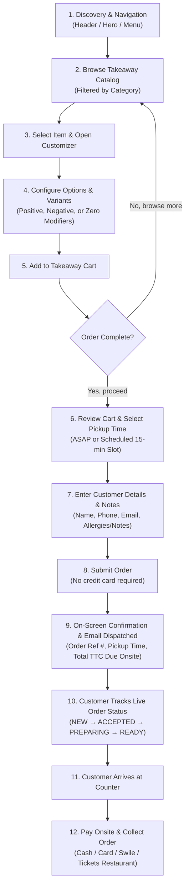
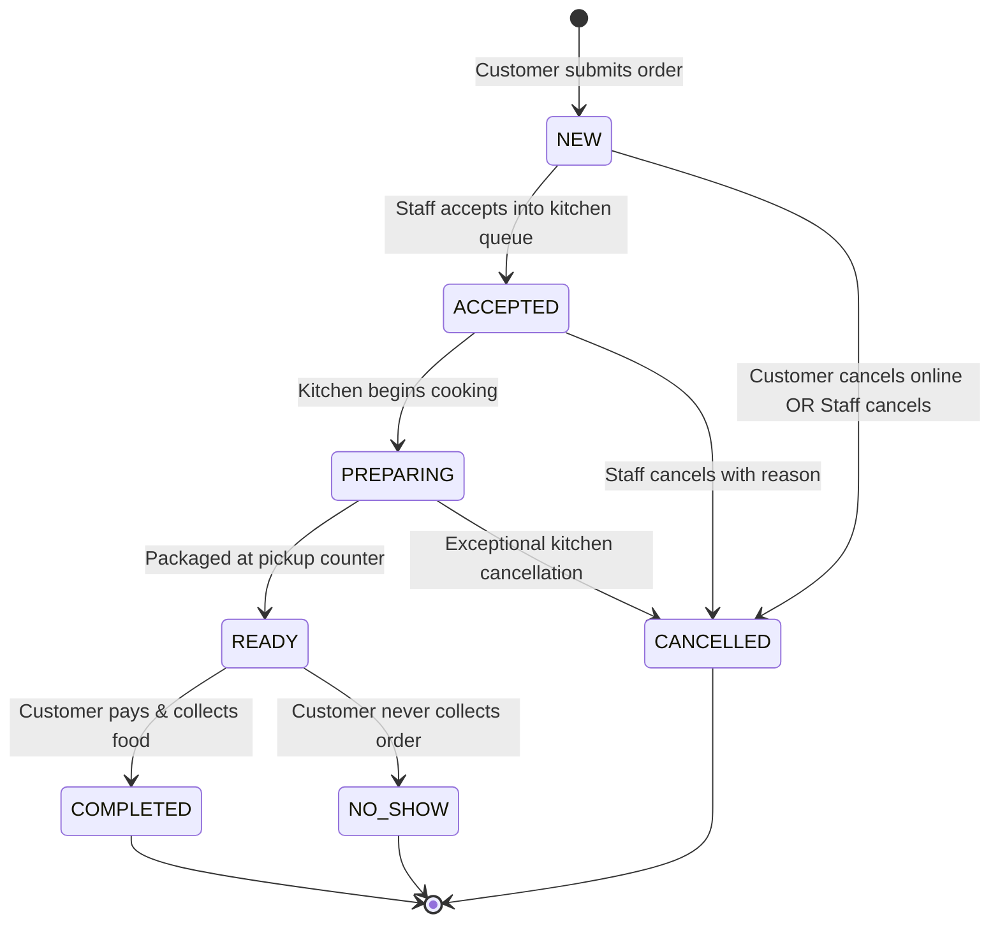

# Takeaway Feature — Functional & Domain Requirements

**Document Status:** Fully Specified & Business Aligned  
**Target Repository:** `lechoppe-official`  
**Governing Standard:** [AGENTS.md](file:///Users/mahabubul.hasan/Desktop/project/TriloyTech/lechoppe-official/AGENTS.md)

---

## 1. Feature Overview

The **Takeaway Ordering System** enables customers of *L'Échoppe de Paris* to browse the restaurant's takeaway menu catalog, customize food and beverage items with option and variant groups (such as burger sizes, cooking temperatures, cheeses, sauces, and extra toppings), manage a real-time shopping cart, and place an online pickup order directly through the official website.

### Core Architectural & Operational Principles
- **No Online Payment (Onsite Counter Settlement)**: Customers place their order online and pay in person (**onsite**) upon collecting their food at the restaurant counter using standard payment methods (Cash, Credit/Debit Card, or French Meal Vouchers / Swile). No payment card data is captured or processed online.
- **Highly Configurable Administration**: All operational variables (operating hours, preparation lead times, pickup slot intervals, closing cutoffs, order limits, pricing rules, VAT rates, pause/busy mode) are admin-configurable with sensible default values.
- **Strict Separation of Lifecycle & Settlement**:
  - **Order Lifecycle Status**: Tracks kitchen and counter workflow (`NEW`, `ACCEPTED`, `PREPARING`, `READY`, `COMPLETED`, `CANCELLED`, `NO_SHOW`).
  - **Payment Settlement Status**: Tracks financial settlement (`UNPAID`, `PAID`) and records the counter payment method (`Cash`, `Card`, `Ticket Restaurant / Swile`, `Other`).
- **Historical Immutability**: Submitted orders store a frozen, self-contained JSON snapshot of item names, descriptions, selected option choices, price modifiers, and VAT rates at the exact time of order placement. Subsequent catalog edits or price updates never alter historical records.
- **Multilingual Standards**: Full 4-language support across all customer-facing and administrative interfaces (**French `fr`**, **English `en`**, **Spanish `es`**, **Italian `it`**).

---

## 2. Objectives

### 2.1 Business Objectives
- Establish a direct, commission-free takeaway channel for *L'Échoppe de Paris*, operating alongside dine-in table reservations and external third-party delivery (Deliveroo).
- Eliminate phone ordering friction, background noise misunderstandings, and manual order entry during service rushes.
- Increase average basket size through intuitive option upsells (specialty cheeses, extra patties, gourmet sauces, sides, drinks).
- Protect kitchen throughput during peak rushes using configurable slot capacities, advance order windows, and a one-click *Pause Takeaway / Busy Mode* switch.

### 2.2 Customer Experience Objectives
- Provide a frictionless guest checkout requiring no account creation, passwords, or credit card entry.
- Deliver real-time price and selection validation during item customization.
- Support transparent pickup scheduling (ASAP or scheduled 15-minute time slots).
- Provide a dedicated, secure order tracking page (`/takeaway/order/[ref]`) with self-service cancellation while the order is in `NEW` status.
- Dispatch automated email confirmation receipts containing pickup summaries, map directions, and counter payment reminders.

### 2.3 Administrative & Operational Objectives
- Centralize takeaway menu, category, and reusable option group management.
- Provide a live incoming order feed with optional audible chimes and visual status pills.
- Support one-click browser printing of high-contrast 80mm thermal kitchen preparation dockets.
- Distinctly track fulfilled orders versus uncollected no-shows for kitchen food waste accounting.

---

## 3. Customer Journey



---

## 4. Admin Global Settings & Kitchen Capacity

All business parameters are managed via a dedicated **Takeaway Settings** configuration panel with sensible defaults:

| Setting Key | Type | Default Value | Description |
| :--- | :--- | :--- | :--- |
| `takeaway_enabled` | Boolean | `false` | Master toggle to enable or disable the entire takeaway feature on the public site. Takeaway requires explicit administrator activation after configuration has been reviewed. |
| `pause_mode` | Boolean | `false` | **One-click Pause Takeaway / Busy Mode**. Instantly halts incoming orders during kitchen overload with a polite frontend notice. |
| `operating_hours` | JSON | Matches Dine-in | Independent takeaway operating schedule (supports distinct lunch/dinner windows per day). |
| `closing_cutoff_minutes` | Integer | `30` min | Cutoff buffer before kitchen closing when takeaway ordering automatically stops accepting orders. |
| `prep_lead_time_minutes` | Integer | `20` min | Default preparation lead time for ASAP pickup calculations. |
| `slot_interval_minutes` | Integer | `15` min | Time interval between selectable pickup slots (e.g. 12:00, 12:15, 12:30, 12:45). |
| `advance_order_max_days` | Integer | `0` (Same-day) | Maximum days in advance a customer can schedule an order (`0` = same-day only; $>0$ allows future scheduling). |
| `max_orders_per_slot` | Integer | `0` (Unlimited) | Maximum orders accepted per 15-minute slot before slot is marked full (`0` = no limit). |
| `min_order_amount` | Decimal | `0.00 €` (None) | Minimum cart subtotal required to place a takeaway order. |
| `max_order_amount` | Decimal | `0.00 €` (None) | Maximum cart subtotal allowed online (`0.00` = no ceiling). |
| `audio_alert_enabled` | Boolean | `true` | Enables/disables the default electronic audio chime on the admin dashboard when a `NEW` order arrives. |
| `accepted_payment_methods` | Array | `["cash", "card", "ticket_restaurant", "other"]` | List of accepted counter payment methods displayed to customers during checkout. |

---

## 5. Takeaway Menu Management & Categories

### 5.1 Takeaway Catalog Controls
- **Takeaway Eligibility**: Each menu item has a `takeaway_available` boolean flag. Existing and newly created/unclassified items default to `false`; an administrator must explicitly opt a product into Takeaway after assigning a valid VAT rate. Items can be available for dine-in only, takeaway only, or both, and the existing catalog is never enabled automatically.
- **Dedicated Takeaway View**: The public website provides a dedicated takeaway catalog tab and filterable presentation.
- **Catalog Ordering**: Admin can sort categories and items to highlight bestsellers, combos, and chef recommendations.

### 5.2 Categories
- **Attributes**: `key` (unique alphanumeric slug), `emoji` (icon), `name` (multilingual: `fr`, `en`, `es`, `it`), `display_order` (integer), `is_active` (boolean).
- **Admin Capabilities**: Create, edit, reorder, translate, and deactivate categories.
- **Frontend Presentation**: Sticky horizontal category navigation bar on mobile and desktop.

---

## 6. Menu Items

### Menu Item Attributes:
- **Identification**: Unique identifier (`id` UUID).
- **Names & Descriptions**: Multilingual labels (`fr`, `en`, `es`, `it`).
- **Base Price**: Base monetary cost in Euros (`price`, decimal TTC).
- **VAT Rate**: Nullable, item-specific French VAT percentage (`vat_rate`). Existing and newly created/unclassified products default to `NULL` and remain unclassified until an administrator explicitly assigns the applicable configured rate. No product-type tax heuristic or automatic `5.50%` assignment is used, and an item cannot be Takeaway-enabled without a valid configured VAT rate.
- **Max Quantity per Order**: Admin-configurable per-item quantity cap (`max_quantity_per_order`, integer, default `0` = unlimited). Prevents sudden kitchen drain (e.g. max 6 of a specialty burger).
- **Flags**: `available` (kitchen stock), `takeaway_available` (takeaway sales), `chef_suggestion` (star badge), `has_allergens`, `allergens_text`.
- **Option Group Links**: Ordered associations linking the item to one or more Option Groups.

---

## 7. Option / Variant Groups

Option Groups define structured sets of choices that customize a menu item.

### 7.1 Architecture & Scope
- **Flat Architecture (MVP)**: All option groups on an item are flat and independent (e.g. Group 1: Size, Group 2: Cheese, Group 3: Extras).
- **Extensibility**: The database structure is decoupled to allow conditional/nested rules (e.g. Formule $\rightarrow$ Drink & Side) in future phases without schema migration issues.
- **Reusable vs. Item-Specific Groups**:
  - **Reusable Groups**: Global templates (e.g., *"Sauces Selection"*, *"Burger Cheeses"*, *"Extra Toppings"*) linked across multiple items.
  - **Item-Specific Groups**: Unique to a single item (e.g., *"Steak Doneness"*).

### 7.2 Selection Rules & Constraints

| Configuration Rule | Constraints | Customer Customizer Behaviour |
| :--- | :--- | :--- |
| **Required Single-Choice** | `is_required = true`<br/>`min_selections = 1`, `max_selections = 1` | Customer must choose exactly 1 option (Radio button / pill). |
| **Optional Single-Choice** | `is_required = false`<br/>`min_selections = 0`, `max_selections = 1` | Customer can choose 0 or 1 option (Radio with "None" or unselectable chip). |
| **Optional Multi-Choice** | `is_required = false`<br/>`min_selections = 0`, `max_selections = N` | Customer can pick between 0 and $N$ options (Checkboxes). |
| **Required Multi-Choice** | `is_required = true`<br/>`min_selections = M`, `max_selections = N` | Customer must select between $M$ and $N$ options inclusive. |

---

## 8. Option Choices

### Option Choice Attributes:
- **Name**: Multilingual display label (`fr`, `en`, `es`, `it`).
- **Price Modifier**: Decimal monetary adjustment (`price_modifier`). Supports:
  - **Positive Modifier**: (e.g. `+1.50 €` for Extra Bacon, `+3.00 €` for Large Size).
  - **Zero Modifier**: (e.g. `+0.00 €` for Standard Bun, Medium Cooking).
  - **Negative Modifier**: (e.g. `-1.50 €` for No Side Salad, `-2.00 €` for Petite Portion).
- **VAT Rate Override**: Optional VAT override (`vat_rate_override`, nullable decimal). If null, the choice inherits the parent menu item's VAT rate.
- **Availability State**: `is_available` boolean. If disabled, choice displays as *"Épuisé / Sold Out"* and is unselectable.
- **Default Choice**: `is_default` boolean. Pre-selected when modal opens where applicable.
- **Display Order**: Integer for ordering choices within the group.

---

## 9. Pricing Rules, Discounts & Tax (VAT)

### 9.1 Price Calculation Formulas

$$\text{Unit Item Price} = \max\left(0.00, \;\; \text{Base Price} + \sum_{i=1}^{k} \text{Selected Option Price Modifier}_i\right)$$

$$\text{Line Item Subtotal} = \text{Unit Item Price} \times \text{Quantity}$$

$$\text{Order Subtotal} = \sum_{j=1}^{m} \text{Line Item Subtotal}_j$$

$$\text{Order Final Total (TTC)} = \max\left(0.00, \;\; \text{Order Subtotal} - \text{Takeaway Promo Discount}\right)$$

### 9.2 Pricing Invariants
- **Non-Negative Invariant**: An item's unit price cannot drop below `0.00 €` regardless of negative price modifiers.
- **Customer Price Display**: All prices displayed to customers are All Taxes Included (**TTC** - *Toutes Taxes Comprises*).
- **Formatting**: Conforms to French locale standard `19,50 €` (and `19.50 €` in EN).

### 9.3 Promotional Codes & Takeaway Eligibility
- Existing promo codes (e.g. `BIENVENUE15`) do **not** apply automatically to takeaway unless explicitly flagged with `takeaway_eligible = true` in admin settings.
- Promos apply a percentage or fixed discount to the order subtotal according to configuration.

### 9.4 French VAT Recording
- VAT is configuration-driven per menu item, with an optional configured override on an option choice. The system does not infer a rate from product type.
- Administrators are responsible for assigning the applicable rate before making an item Takeaway-eligible. Rates such as `5.50%`, `10.00%`, or `20.00%` are illustrative supported configurations, not automatic classifications or defaults.
- The order snapshot records the calculated VAT amounts per rate tier for accounting and historical reporting.

---

## 10. Cart Behaviour & Order Constraints

### 10.1 Line Item Mechanics
- Each unique combination of **[Item ID + Option Choices + Special Instructions]** forms a discrete cart line item.
- Adding the identical item with identical options increments quantity.
- Quantity per line item is subject to `max_quantity_per_order` if configured on the item.

### 10.2 Cart Order Constraints
- **Minimum Order Amount**: If subtotal $< \text{min\_order\_amount}$, checkout button is disabled with a notice: *"Montant minimum de commande : X,XX €"*.
- **Maximum Order Amount**: If subtotal $> \text{max\_order\_amount}$ (when configured $>0$), customer is prompted to contact restaurant by phone for large banquets.
- **Local Persistence**: Cart state persists across page refreshes and language toggles via `localStorage`.

---

## 11. Customer Information & Verification

### Mandatory Checkout Information:
| Field Name | Type | Purpose | Validation Rules |
| :--- | :--- | :--- | :--- |
| `customer_name` | Text | Counter pickup identification | Min 2 characters, trimmed. |
| `customer_phone` | Tel | Pickup coordination & emergency contact | Valid international or French phone format (`+33...` or `06/07...`). |
| `customer_email` | Email | Confirmation receipt & tracking link | RFC 5322 email regex. |
| `pickup_time_type` | Enum | `asap` or `scheduled` | Must be active within takeaway hours. |
| `pickup_time` | ISO/Time | Specific slot if scheduled | Within opening hours, respecting cutoff & max orders per slot. |
| `customer_notes` | Textarea | Preparation notes or allergy reminders | Optional, max 500 chars. |

### Anti-Abuse & Bot Protection (MVP):
- Public rate limiting on order submissions (IP and session throttling).
- Honeypot anti-spam form fields and frontend bot checks (`BotCheck`).
- Mandatory phone number validation.
- *(Future Enhancement: SMS / OTP one-time verification).*

---

## 12. Order Submission & Transactional Email

### 12.1 Submission Workflow
1. Customer submits order $\rightarrow$ Server recalculates and validates all items, options, slot capacities, and operating hours.
2. Unique human-readable Order Reference generated (e.g. `#ECH-8419`).
3. Order record and immutable snapshot saved to database.
4. Immediate redirection to **Order Confirmation Screen**.
5. Automated **Confirmation Email** dispatched to customer.

### 12.2 Transactional Email Architecture
- **Provider Strategy**: **Resend** is the default/preferred provider. If an existing email integration is present in the codebase, it is reused.
- **Decoupled Architecture**: Email dispatch is encapsulated behind a clean service adapter interface so providers can be swapped via environment variables without altering Takeaway business logic.
- **Credentials**: All API keys and secrets stored strictly in environment variables (`RESEND_API_KEY`, etc.).
- **Email Content**:
  - Order Reference `#`
  - Direct link to the live **Order Tracking Page**
  - Itemized summary with option breakdown
  - Total TTC amount payable at counter
  - Scheduled pickup time and restaurant location map link
  - Onsite payment reminder: *"Paiement sur place lors du retrait (Espèces, CB, Titres Restaurant / Swile)"*.
  - Rendered in the customer's selected language (`fr`, `en`, `es`, `it`).

---

## 13. Customer Order Tracking & Online Cancellation

### 13.1 Live Tracking Page (`/takeaway/order/[ref]`)
- Customer can access their order tracking page via confirmation screen or email link.
- Displays live status stepper: `NEW` $\rightarrow$ `ACCEPTED` $\rightarrow$ `PREPARING` $\rightarrow$ `READY` $\rightarrow$ `COMPLETED`.
- Live status polling keeps the customer informed in real time.

### 13.2 Online Customer Cancellation Rules:
- **Allowed**: While the order is in `NEW` status, a prominent **"Annuler ma commande / Cancel Order"** button is available on the tracking page.
- **Locked**: As soon as staff transitions the order to `ACCEPTED` or `PREPARING`, online cancellation is locked. The tracking page instructs the customer to call the restaurant directly.

---

## 14. Order Lifecycle & Status Transitions



### Lifecycle Status Definitions:
- `NEW`: Order received; pending staff review. (Customer online cancellation permitted).
- `ACCEPTED`: Staff confirmed order and slotted into kitchen workflow.
- `PREPARING`: Items are actively cooking / being packaged.
- `READY`: Order is boxed, bagged, and waiting at the counter.
- `COMPLETED`: Customer arrived, settled payment, and received food.
- `CANCELLED`: Order was cancelled by customer (in `NEW`) or rejected by staff with a predefined reason.
- `NO_SHOW`: Food was prepared and marked `READY`, but the customer never collected their order. (Kept separate from `CANCELLED` for loss tracking).

### 14.1 Staff Cancellation Reasons
When staff cancels an order from the admin dashboard, they must select a predefined cancellation reason with an optional note:

| Reason Code | Label (FR) | Label (EN) | Explanation Requirement |
| :--- | :--- | :--- | :--- |
| `kitchen_capacity` | Cuisine saturée | Kitchen at capacity | Optional note. |
| `item_unavailable` | Ingrédient / Plat épuisé | Item unavailable | Optional note. |
| `customer_request` | Demande du client (téléphone) | Customer request | Optional note. |
| `duplicate_or_fraud` | Doublon / Commande suspecte | Duplicate / Fraudulent | Optional note. |
| `other` | Autre motif | Other | **Mandatory free-text explanation**. |

The cancellation reason code, localized label, and note are stored directly with the historical order record. The database schema stores reasons flexibly so admin-managed reason lists can be added in future phases without schema alterations.

---

## 15. Payment Rules & Staff Settlement

1. **Strictly Onsite Counter Payment**: No payment card data is captured or processed online.
2. **Independent Payment State**:
   - `payment_status`: `UNPAID` (default) $\leftrightarrow$ `PAID`.
3. **Payment Method Recording**: When staff marks an order as `PAID`, they record the counter payment method:
   - `cash` (Espèces)
   - `card` (Carte Bancaire / Visa / Mastercard / Contactless)
   - `ticket_restaurant` (Titres Restaurant papier / Carte Swile / Edenred / Resto Flash)
   - `other` (Autre règlement)
4. **Staff Order Editing Policy**:
   - Staff cannot edit line items of submitted orders in MVP.
   - Staff can edit pickup time, internal notes, order status, and payment status.
   - If a customer calls for significant line-item additions/changes, staff cancels the order and recreates it.

---

## 16. Admin Order Management & Kitchen Docket

Restaurant staff manage takeaway orders through a dedicated **"🥡 Commandes / Takeaway"** tab in the admin dashboard:

### Interface Features:
- **Live Order Feed**: Chronological list sorted by pickup urgency with distinct visual status pills.
- **Audio Chime on New Orders**:
  - Plays a clean default electronic chime when a `NEW` order arrives.
  - Can be toggled on/off in admin settings (`audio_alert_enabled`). Custom audio upload is out of scope for MVP.
- **Quick Status Workflow Buttons**: One-click actions (`Accepter`, `En préparation`, `Prêt`, `Terminé`, `Non Récupéré / No-Show`, `Annuler`).
- **Payment Method Toggle Modal**: Prompts staff to choose `Espèces`, `Carte`, `Titre Restaurant`, or `Autre` upon marking `PAID`.
- **Search & History Filters**: Search by Ref `#`, Customer Name, Phone, Date range, and Status tabs (*En cours*, *Prêtes*, *Terminées*, *No-Shows*, *Annulées*).

### 16.1 80mm Kitchen Preparation Docket Print
A one-click **"Imprimer Bon Cuisine / Print Docket"** button generates a clean, high-contrast, black-and-white 80mm preparation docket via browser print CSS (`@media print`):

```
================================================
           L'ÉCHOPPE DE PARIS
             BON DE CUISINE
================================================
COMMANDE : #ECH-8419
DATE     : 21/08/2026 12:30
RETRAIT  : 13:15 (PROGRAMMÉ)

CLIENT   : Jean DUPONT
TÉL      : +33 6 12 34 56 78
------------------------------------------------
2x LE DALLAS
   - Cuisson : Saignant
   - Fromage : Cheddar Affiné
   - Extras  : Bacon Croustillant

1x FRITES MAISON DOUBLE CUISSON
   - Sauce   : Sauce Secrète Maison

1x MOELLEUX AU CHOCOLAT
------------------------------------------------
NOTE CLIENT :
** Sauce à part svp **
------------------------------------------------
TOTAL À ENCAISSER SUR PLACE : 45,00 €
STATUT RÈGLEMENT : [ NON PAYÉ ]
================================================
```

*Note: The 80mm docket is strictly an internal kitchen preparation sheet. SIRET, VAT registration numbers, and fiscal receipt compliance are out of scope for this printout.*

---

## 17. Historical Order & Snapshot Requirements

> [!IMPORTANT]
> **Immutability Guarantee**: Every submitted order stores a frozen, self-contained JSON snapshot. Future edits to menu item names, prices, VAT rates, option groups, or choice modifiers will never alter historical order records.

### Snapshot Schema Structure:
The following snapshot is an illustrative order whose items were explicitly configured with a `5.50%` VAT rate; it does not represent a catalog default.

```json
{
  "order_reference": "ECH-8419",
  "currency": "EUR",
  "placed_at": "2026-08-21T12:30:00Z",
  "customer": {
    "name": "Jean Dupont",
    "phone": "+33612345678",
    "email": "jean.dupont@email.fr",
    "pickup_type": "scheduled",
    "pickup_time": "2026-08-21T13:15:00Z",
    "notes": "Sauce à part svp"
  },
  "items": [
    {
      "item_id": "uuid-here",
      "name": "Le Dallas",
      "base_price": 19.00,
      "vat_rate": 5.50,
      "quantity": 2,
      "selected_options": [
        {
          "group_name": "Cuisson",
          "choice_name": "Saignant",
          "price_modifier": 0.00,
          "vat_rate": 5.50
        },
        {
          "group_name": "Fromage",
          "choice_name": "Cheddar Affiné",
          "price_modifier": 1.50,
          "vat_rate": 5.50
        },
        {
          "group_name": "Extras",
          "choice_name": "Bacon Croustillant",
          "price_modifier": 2.00,
          "vat_rate": 5.50
        }
      ],
      "unit_price_ttc": 22.50,
      "line_total_ttc": 45.00
    }
  ],
  "totals": {
    "subtotal_ttc": 45.00,
    "discount_ttc": 0.00,
    "promo_code": null,
    "final_total_ttc": 45.00,
    "vat_breakdown": [
      {
        "rate": 5.50,
        "base_ht": 42.65,
        "vat_amount": 2.35
      }
    ]
  },
  "cancellation": {
    "reason_code": null,
    "reason_label": null,
    "note": null
  }
}
```

---

## 18. Validation Rules

### 18.1 Client-Side Validation
- Required option groups must satisfy `min_selections` before cart addition.
- Multi-select choices disable unchecked boxes once `max_selections` is reached.
- Phone, email, name, and pickup slot selection verified before submission.
- Cart subtotal checked against `min_order_amount` and `max_order_amount`.

### 18.2 Server-Side Validation
- Re-validate item availability, option memberships, and recalculate unit prices and totals.
- Reject orders if takeaway is disabled or pause/busy mode is active.
- Verify selected pickup slot is within operating hours, after closing cutoff, and within `max_orders_per_slot` capacity.
- Prevent price manipulation by rejecting client-calculated sums that deviate from server formulas.

---

## 19. Localization

Full multi-language coverage across **French (`fr`)**, **English (`en`)**, **Spanish (`es`)**, and **Italian (`it`)**:

- **Static UI**: Customizer modals, cart drawers, checkout forms, tracking pages, confirmation badges, print dockets, and error messages.
- **Dynamic Catalog**: Category names, menu item names & descriptions, option group titles, choice names, and allergen labels.
- **Email Receipts**: Rendered in the language selected by the customer during order placement.

---

## 20. Responsive Behaviour & Print Design

- **Mobile Viewports ($\le 768\text{px}$)**:
  - Bottom sheet customization drawer with thumb-friendly radio/checkbox chips.
  - Floating cart trigger bar with badge count and subtotal.
  - Sticky bottom CTA inside customizer (*"Ajouter au panier — XX,XX €"*).
  - Lenis scroll locking (`data-lenis-prevent="true"`) to prevent backdrop page jumping.
- **Desktop Viewports ($> 768\text{px}$)**:
  - Elegant modal with backdrop blur.
  - Slide-over cart drawer on the right side of the screen.
  - Wide admin table and order inspector cards.
- **Thermal Print Stylesheet (`@media print`)**:
  - Formatted strictly for 80mm roll width.
  - High-contrast typography, zero browser headers/footers, clear separation lines.

---

## 21. Security & Data Privacy

- **Admin Endpoints**: Protected via existing `lechoppe_admin_auth` cookie authentication.
- **Public Endpoints**: Rate-limited, honeypot protected, sanitized against SQL injection via PostgreSQL parameterization.
- **Customer Privacy**: Data collected solely for order fulfillment under GDPR compliance.

---

## 22. Scope Boundaries

| In Scope (Confirmed MVP) | Future Enhancements (Post-MVP) | Out of Scope |
| :--- | :--- | :--- |
| Onsite Counter Payment only | SMS / OTP Customer Verification | Online Payment Gateways (Stripe/PayPal) |
| Flat / Independent Option Groups | Conditional / Nested Option Groups | Direct ESC/POS raw hardware printer drivers |
| Automated Email via Resend Adapter | Customer SMS Status Notifications | Delivery driver dispatch / GPS tracking |
| Customer Live Tracking Page (`/takeaway/order/[ref]`) | Automatic Phone Number Blacklisting | Customer Account / Password Logins |
| Online Cancellation during `NEW` status | In-App Staff Line-Item Editing | Table Ordering / QR In-Restaurant Ordering |
| Browser-based 80mm Docket Print | Multi-Location / Multi-Branch Routing | Customer Fiscal Invoicing / Fiscal Cash Register Module |
| Independent Operating Hours & Capacity Limits | Inventory / Ingredient Stock Counts | Native Mobile App |
| `NO_SHOW` / `UNCOLLECTED` Status Tracking | Admin UI for Cancellation Reason CRUD | |
| Staff Cancellation Reasons with Predefined Codes | Custom Audio File Upload UI | |

---

## 23. Acceptance Criteria

### Customer Experience:
- [ ] Customer can browse takeaway catalog filtered by category.
- [ ] Customer can customize items with positive, negative, and zero price modifiers.
- [ ] Required and multi-choice constraints are strictly enforced before adding to cart.
- [ ] Cart reflects line item pricing, min/max order limits, and slot selection.
- [ ] Customer completes guest checkout without any payment card prompts.
- [ ] Customer receives on-screen confirmation and confirmation email with order reference `#`.
- [ ] Customer can view live tracking at `/takeaway/order/[ref]` and cancel online while status is `NEW`.
- [ ] UI is completely localized in `fr`, `en`, `es`, and `it`.

### Admin Management:
- [ ] Admin can toggle Takeaway on/off and activate One-Click *Pause / Busy Mode*.
- [ ] Takeaway remains disabled until an administrator reviews configuration and explicitly activates it.
- [ ] Existing and new/unclassified menu items remain Takeaway-ineligible until an administrator assigns a valid VAT rate and explicitly opts them in.
- [ ] Admin can configure operating hours, closing cutoffs, lead times, slot intervals, advance booking days, and max orders per slot.
- [ ] Admin can manage categories, menu items, reusable option groups, and individual option choices.
- [ ] Admin receives incoming orders with default audio chime alert (toggleable in settings).
- [ ] Admin can advance order statuses (`NEW` $\rightarrow$ `ACCEPTED` $\rightarrow$ `PREPARING` $\rightarrow$ `READY` $\rightarrow$ `COMPLETED` / `CANCELLED` / `NO_SHOW`).
- [ ] Admin staff cancellation requires selecting a predefined reason code (`kitchen_capacity`, `item_unavailable`, `customer_request`, `duplicate_or_fraud`, `other`) and mandatory text for `other`.
- [ ] Admin can toggle payment status (`UNPAID` $\leftrightarrow$ `PAID`) and select payment method (`Cash`, `Card`, `Swile`, `Other`).
- [ ] Admin can click "Print Docket" to print an 80mm kitchen preparation docket via browser print dialog.

### Data & Snapshot Integrity:
- [ ] Historical orders retain 100% immutable snapshots including items, options, modifiers, VAT breakdown, and cancellation reasons.
- [ ] Server validates all calculations, preventing price manipulation.

---

## 24. Confirmed Assumptions & Operational Defaults

1. **Default Takeaway Activation**: Disabled (`takeaway_enabled = false`) until an administrator reviews the configuration and explicitly activates it.
2. **Default Product Eligibility**: Existing and new/unclassified menu items are ineligible (`takeaway_available = false`) until an administrator explicitly opts them in.
3. **Default VAT Classification**: Unclassified (`vat_rate = NULL`); a valid administrator-configured VAT rate is required before Takeaway eligibility can be enabled.
4. **Default Lead Time**: 20 minutes for ASAP orders.
5. **Default Slot Interval**: 15 minutes.
6. **Default Operating Hours**: Matches existing restaurant opening hours unless custom takeaway schedule is provided.
7. **Default Closing Cutoff**: 30 minutes before kitchen close.
8. **Default Advance Order Window**: Same-day only (`0` days).
9. **Default Capacity**: Unlimited orders per slot (`0`) unless configured.
10. **Default Per-Item Cap**: Unlimited (`0`) unless configured on the item.
11. **Default Minimum/Maximum Order Amount**: None (`0.00 €`).
12. **Counter Payment Recording**: Staff manually selects `cash`, `card`, `ticket_restaurant`, or `other` upon collection.
13. **Email Delivery**: Resend used via decoupled adapter with API key stored in `RESEND_API_KEY`.
14. **Audio Chime**: Clean default electronic notification sound bundled as a static asset.

---

## 25. Open Technical / Business Items

All fundamental business domain requirements and operational workflows for the Takeaway feature MVP are now **100% resolved and locked**.

The only remaining technical prerequisite for implementation is:
- **Resend API Key Provisioning**: When deploying to runtime, the `RESEND_API_KEY` (and sending domain / sender email address, e.g. `commandes@lechoppedeparis.fr` or `onboarding@resend.dev` for development) must be configured in the environment. In the absence of an API key during local development, the email adapter will gracefully log the rendered email output to the console without throwing an unhandled exception.
